# lab 4 - test

## 1. Deloy docker
**[DOCKER HUB](https://hub.docker.com/r/dangdan2807/ktvtkpm-lab4)**  

**Bước 1**: chạy lệnh sau để tạo 1 image spring làm nền tảng để build docker compose  
```
docker build --tag ktvtkpm-lab4:v1.0.0 .
```
**Bước 1.1**: mở file `application.properties` tại `src/main/resources` và thay đổi như sau:
```
<!-- dành cho docker -->
spring.datasource.url=jdbc:mysql://mysql-ktvtpm-lab4-container:3306/qlchuyenbay

<!-- dành cho localhost -->
spring.datasource.url=jdbc:mysql://localhost:3306/qlchuyenbay
```

**Bước 2**: chạy lệnh để tạo 1 compose  
```
docker compose up --build
```
**Bước 3**: chạy docker container vừa được tạo ra có tên `quanlychuyenbay` (trên giao diện `docker desktop`) hoặc dùng lệnh sau:
```
docker compose start 
```
**Bước 4**: Lúc này theo mặc định thì server đang chạy ở port `13000`. 
- Truy cập [localhost](http://localhost:13000/) nếu hiển thị `ok` thì server đã hoạt động bình thường
- Truy cập [localhost/insert-db](http://localhost:13000/insert-db) để thêm dữ liệu mẫu vào database
- Tiến hành tiến theo bảng bên dưới

**Khác** để dừng docker compose dùng lệnh
```
docker compose stop
```

## 2. Test

| câu | đường dẫn | kết quả |  
| :-- | :-------- | :--- |  
| 1.Cho biết các chuyến bay đi Đà Lạt (DAD). | [/chuyen-bay/di-da-lat](http://localhost:13000/chuyen-bay/di-da-lat) | 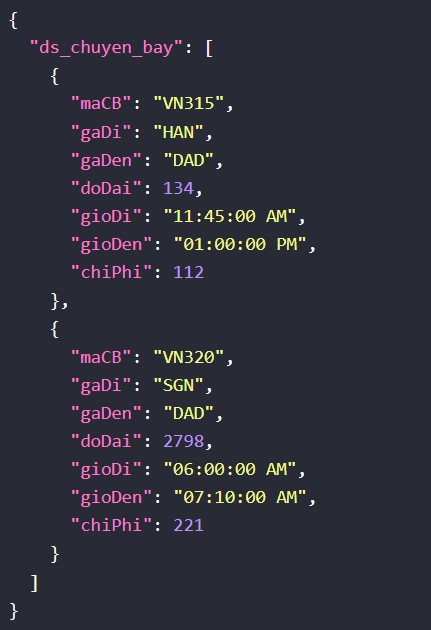 |  
| 2.Cho biết các loại máy bay có tầm bay lớn hơn 10,000km. | [/chuyen-bay/lon-hon-10kkm](http://localhost:13000/chuyen-bay/lon-hon-10kkm) | 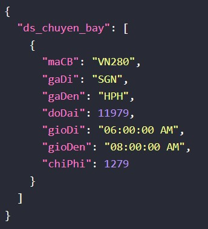 |  
| 3.Tìm các nhân viên có lương nhỏ hơn 10,000. | [/nhan-vien/luong-nho-hon/10000](http://localhost:13000/nhan-vien/luong-nho-hon/10000) | 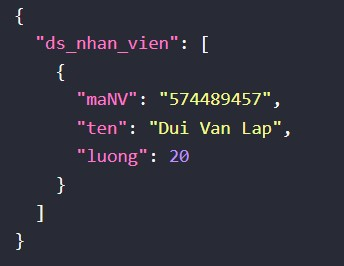 |  
| 4.Cho biết các chuyến bay có độ dài đường bay nhỏ hơn 10.000km và lớn hơn 8.000km | [/chuyen-bay/do-dai-duong-bay?tu=8000&den=10000](http://localhost:13000/chuyen-bay/do-dai-duong-bay?tu=8000&den=10000) | 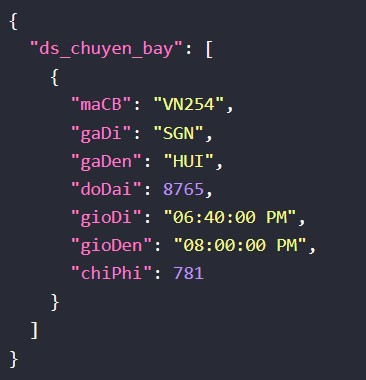 |  
| 5.Cho biết các chuyến bay xuất phát từ Sài Gòn (SGN) đi Ban Mê Thuộc (BMV) | [/chuyen-bay/sai-gon-di-buon-me-thuoc](http://localhost:13000/chuyen-bay/sai-gon-di-buon-me-thuoc) | 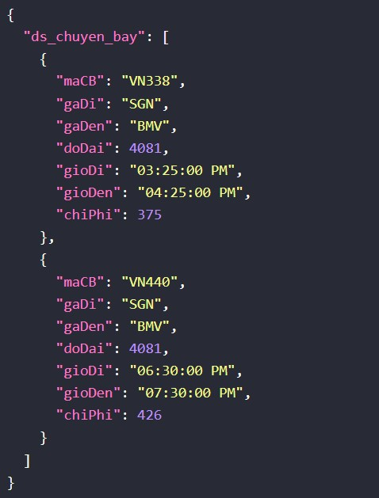 |  
| 6.Có bao nhiêu chuyến bay xuất phát từ Sài Gòn (SGN). | [/chuyen-bay/so-chuyen/sai-gon](http://localhost:13000/chuyen-bay/so-chuyen/sai-gon) | 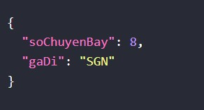 |  
| 7.Có bao nhiêu loại máy báy Boeing. | [/may-bay/so-may-bay/boeing](http://localhost:13000/may-bay/so-may-bay/boeing) | 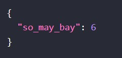 |  
| 8.Cho biết tổng số lương phải trả cho các nhân viên. | [/nhan-vien/tong-luong](http://localhost:13000/nhan-vien/tong-luong) | 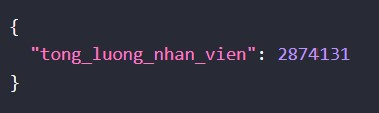 |  
| 9.Cho biết mã số của các phi công lái máy báy Boeing. | [/nhan-vien/phi-cong-lai-boeing/ma](http://localhost:13000/nhan-vien/phi-cong-lai-boeing/ma) | 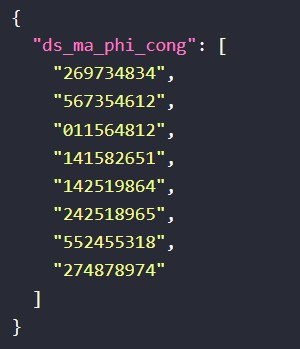 |  
| 10.Cho biết các nhân viên có thể lái máy bay có mã số 747 | [/nhan-vien/phi-cong-lai-may-bay?mamb=747](http://localhost:13000/nhan-vien/phi-cong-lai-may-bay?mamb=747) | 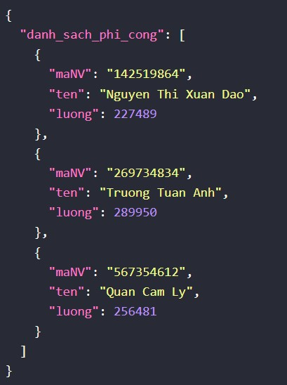 |  
| 11.Cho biết mã số của các loại máy bay mà nhân viên có họ Nguyễn có thể lái. | [/may-bay/phi-cong-ho-nguyen](http://localhost:13000/may-bay/phi-cong-ho-nguyen) | 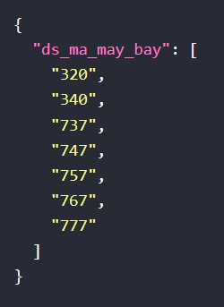 |  
| 12.Cho biết mã số của các phi công vừa lái được Boeing vừa lái được Airbus | [/nhan-vien/phi-cong-lai-may-bay-boeing-airbus](http://localhost:13000/nhan-vien/phi-cong-lai-may-bay-boeing-airbus) | 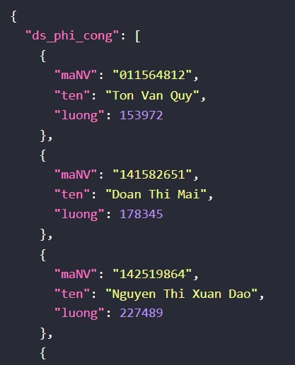 |  
| 13.Cho biết các loại máy bay có thể thực hiện chuyến bay VN280. | [/may-bay/thuc-hien-chuyen-bay/vn280](http://localhost:13000/may-bay/thuc-hien-chuyen-bay/vn280) | 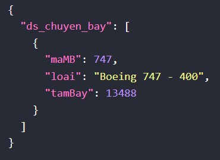 |  
| 14.Cho biết các chuyến bay có thể được thực hiện bởi máy bay Airbus A320. | [/chuyen-bay/thuc-hien-chuyen-bay/Airbus%20A320](http://localhost:13000/chuyen-bay/thuc-hien-chuyen-bay/Airbus%20A320) | 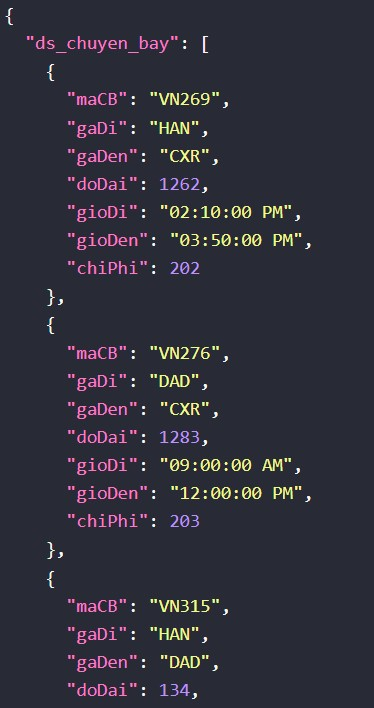 |  
| 15.Cho biết tên của các phi công lái máy bay Boeing. | [/nhan-vien/phi-cong-lai-boeing/ten](http://localhost:13000/nhan-vien/phi-cong-lai-boeing/ten) | 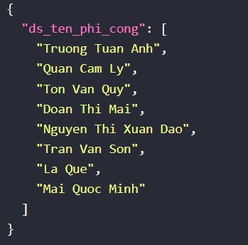 |  
| 16.Với mỗi loại máy bay có phi công lái cho biết mã số, loại máy báy và tổng số phi công có thể lái loại máy bay đó. | [/may-bay/loai-may-bay-va-so-phi-cong-lai](http://localhost:13000/may-bay/loai-may-bay-va-so-phi-cong-lai) | 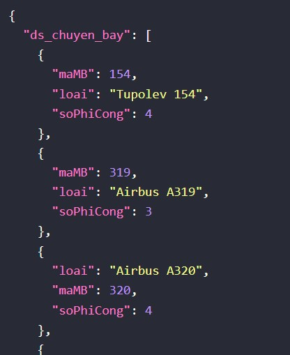 |  
| 17.Giả sử một hành khách muốn đi thẳng từ ga A đến ga B rồi quay trở về ga A. Cho biết các đường bay nào có thể đáp ứng yêu cầu này. | [/chuyen-bay/chuyen-bay-va-tro-ve/sgn/dad](http://localhost:13000/chuyen-bay/chuyen-bay-va-tro-ve/sgn/dad) | 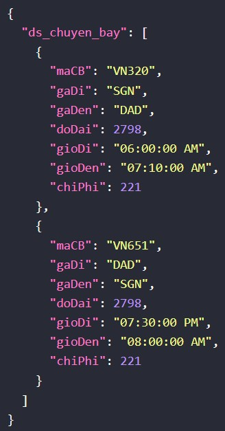 |  
| 18.Với mỗi ga có chuyến bay xuất phát từ đó cho biết có bao nhiêu chuyến bay khởi hành từ ga đó | [/chuyen-bay/so-chuyen/SGN](http://localhost:13000/chuyen-bay/so-chuyen/SGN) |  |  
| 19.Với mỗi ga có chuyến bay xuất phát từ đó cho biết tổng chi phí phải trả cho phi công lái các chuyến bay khởi hành từ ga đó. | [/chuyen-bay/tong-chi-phi-tra-cho-phi-cong/SGN](http://localhost:13000/chuyen-bay/tong-chi-phi-tra-cho-phi-cong/SGN) | 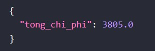 |  
| 20.Cho biết danh sách các chuyến bay có thể khởi hành trước 12:00 | [/chuyen-bay/truoc-gio/12:00:00](http://localhost:13000/chuyen-bay/truoc-gio/12:00:00) | 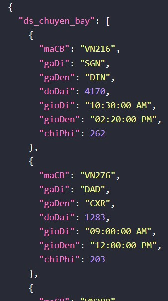 |  
| 21.Với mỗi địa điểm xuất phát cho biết có bao nhiêu chuyến bay có thể khởi hành trước 12:00. | [/chuyen-bay/so-chuyen-bay-truoc-12-gio/SGN](http://localhost:13000/chuyen-bay/so-chuyen-bay-truoc-12-gio/SGN) | 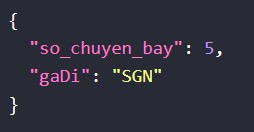 |  
| 22.Cho biết mã số của các phi công chỉ lái được 3 loại máy bay. | [/nhan-vien/phi-cong-lai-3-loai-mb](http://localhost:13000/nhan-vien/phi-cong-lai-3-loai-mb) | 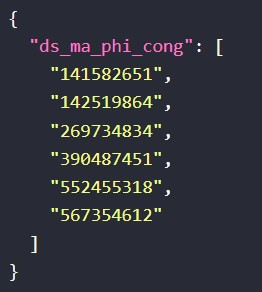 |  
| 23.Với mỗi phi công có thể lái nhiều hơn 3 loại máy bay, cho biết mã số phi công và tầm bay lớn nhất của các loại máy bay mà phi công đó có thể lái | [/nhan-vien/phi-cong-lai-3-loai-mb-va-tam-bay](http://localhost:13000/nhan-vien/phi-cong-lai-3-loai-mb-va-tam-bay) | 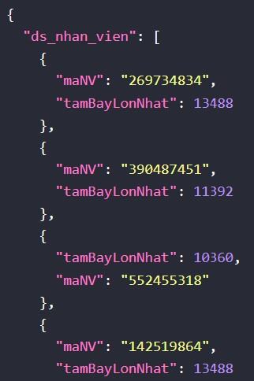 |  
| 24.Với mỗi phi công cho biết mã số phi công và tổng số loại máy bay mà phi công đó có thể lái | [/nhan-vien/so-may-bay-phi-cong-lai-duoc](http://localhost:13000/nhan-vien/so-may-bay-phi-cong-lai-duoc) | 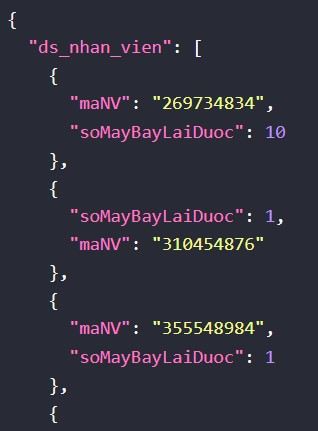 |  
| 25.Tìm các nhân viên không phải là phi công. | [/nhan-vien/khong-phai-la-phi-cong](http://localhost:13000/nhan-vien/khong-phai-la-phi-cong) | 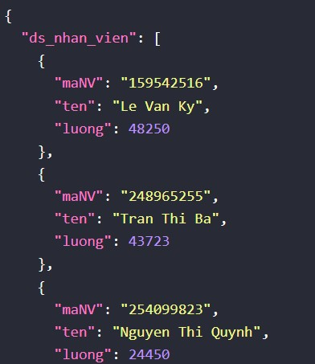 |  
| 26.Cho biết mã số của các nhân viên có lương cao nhất. | [/nhan-vien/luong-cao-nhat](http://localhost:13000/nhan-vien/luong-cao-nhat) | 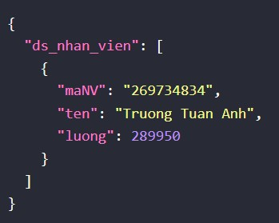 |  
| 27.Cho biết tổng số lương phải trả cho các phi công | [/nhan-vien/tong-luong-phi-cong](http://localhost:13000/nhan-vien/tong-luong-phi-cong) | 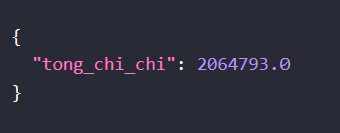 |  
| 28.Tìm các chuyến bay có thể được thực hiện bởi tất cả các loại máy bay Boeing. | [/chuyen-bay/chuyen-bay-bang-loai-may-bay-boeing](http://localhost:13000/chuyen-bay/chuyen-bay-bang-loai-may-bay-boeing) | 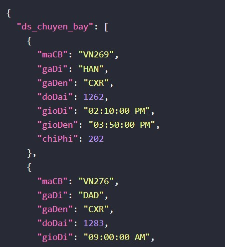 |  
